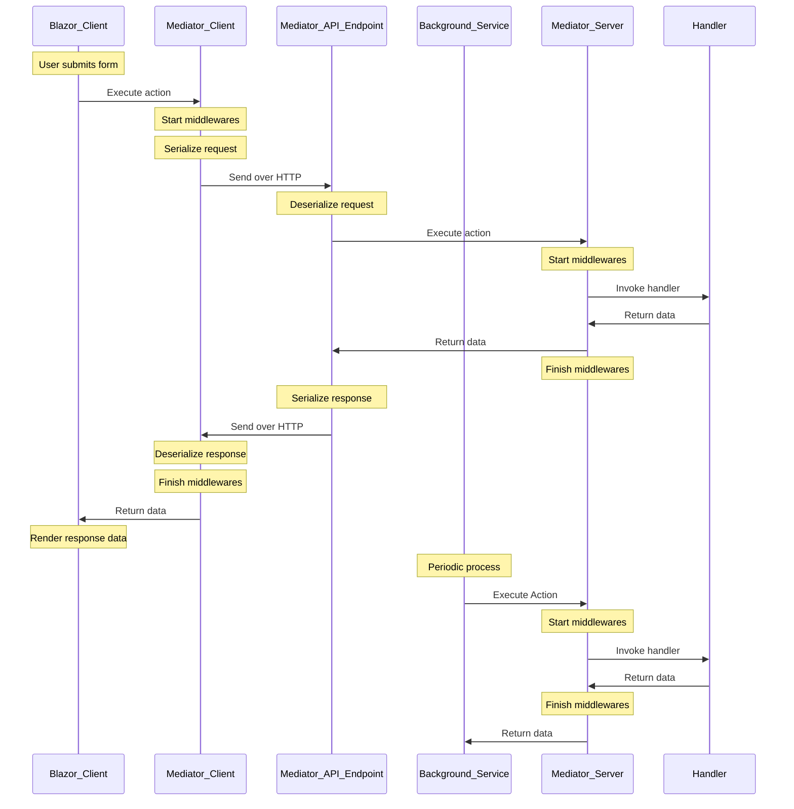

# Invocation from Client vs Background service

```mermaid
sequenceDiagram
    participant Blazor_Client
    participant Mediator_Client
    participant Mediator_API_Endpoint
    participant Background_Service
    participant Mediator_Server
    participant Handler

    Note over Blazor_Client: User submits form
    Blazor_Client->>Mediator_Client: Execute action
    
    Note over Mediator_Client: Start middlewares
    Note over Mediator_Client: Serialize request
    Mediator_Client->>Mediator_API_Endpoint: Send over HTTP 
    Note over Mediator_API_Endpoint: Deserialize request
    Mediator_API_Endpoint->>Mediator_Server: Execute action
    Note over Mediator_Server: Start middlewares
    Mediator_Server->>Handler: Invoke handler
    Handler->>Mediator_Server: Return data
    Mediator_Server->>Mediator_API_Endpoint: Return data
    Note over Mediator_Server: Finish middlewares
    Note over Mediator_API_Endpoint: Serialize response
    Mediator_API_Endpoint->>Mediator_Client: Send over HTTP 
    Note over Mediator_Client: Deserialize response
    Note over Mediator_Client: Finish middlewares
    Mediator_Client->>Blazor_Client: Return data
    Note over Blazor_Client: Render response data

    Note over Background_Service: Periodic process
    Background_Service->>Mediator_Server: Execute Action
    Note over Mediator_Server: Start middlewares
    Mediator_Server->>Handler: Invoke handler
    Handler->>Mediator_Server: Return data
    Note over Mediator_Server: Finish middlewares
    Mediator_Server->>Background_Service: Return data


```