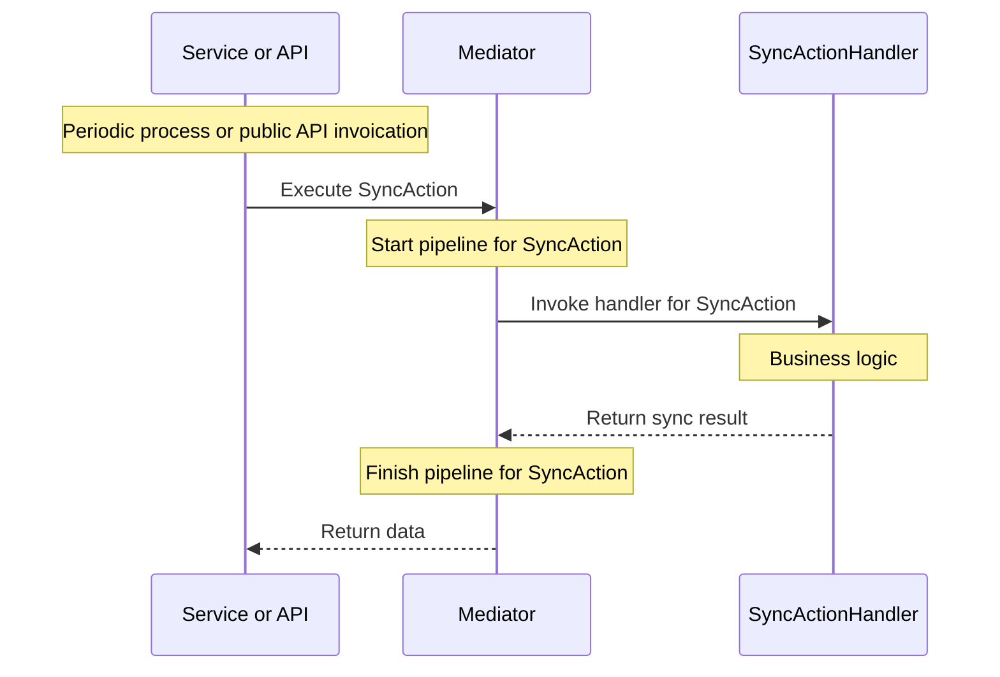
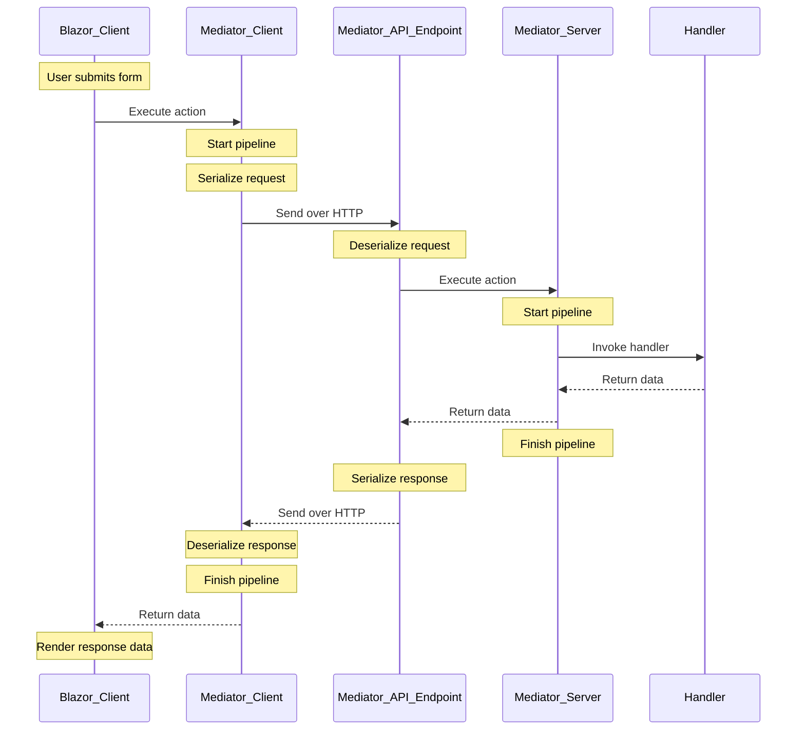
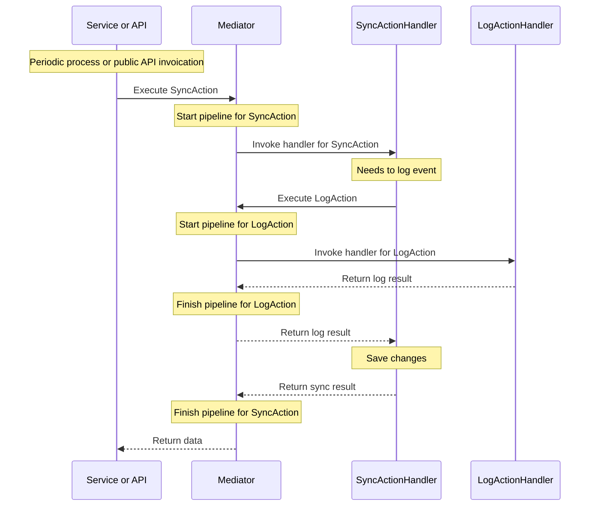

# Simple Mediator call example (in process)

```mermaid
sequenceDiagram
    participant Service as Service or API
    participant Mediator
    participant Handler as SyncActionHandler

    Note over Service: Periodic process or public API invoication
    Service->>Mediator: Execute SyncAction
    Note over Mediator: Start pipeline for SyncAction
    Mediator->>Handler: Invoke handler for SyncAction

    Note over Handler: Business logic

    Handler-->>Mediator: Return sync result
    Note over Mediator: Finish pipeline for SyncAction
    Mediator-->>Service: Return data
```

# Mediator call over HTTP

```mermaid
sequenceDiagram
    participant Blazor_Client
    participant Mediator_Client
    participant Mediator_API_Endpoint
    participant Mediator_Server
    participant Handler

    Note over Blazor_Client: User submits form
    Blazor_Client->>Mediator_Client: Execute action
    
    Note over Mediator_Client: Start pipeline
    Note over Mediator_Client: Serialize request
    Mediator_Client->>Mediator_API_Endpoint: Send over HTTP 
    Note over Mediator_API_Endpoint: Deserialize request
    Mediator_API_Endpoint->>Mediator_Server: Execute action
    Note over Mediator_Server: Start pipeline
    Mediator_Server->>Handler: Invoke handler
    Handler-->>Mediator_Server: Return data
    Mediator_Server-->>Mediator_API_Endpoint: Return data
    Note over Mediator_Server: Finish pipeline
    Note over Mediator_API_Endpoint: Serialize response
    Mediator_API_Endpoint-->>Mediator_Client: Send over HTTP 
    Note over Mediator_Client: Deserialize response
    Note over Mediator_Client: Finish pipeline
    Mediator_Client-->>Blazor_Client: Return data
    Note over Blazor_Client: Render response data
```

# Nested calls (works for both client and server)

```mermaid
sequenceDiagram
    participant Service as Service or API
    participant Mediator
    participant Handler_A as SyncActionHandler
    participant Handler_B as LogActionHandler

    Note over Service: Periodic process or public API invoication
    Service->>Mediator: Execute SyncAction
    Note over Mediator: Start pipeline for SyncAction
    Mediator->>Handler_A: Invoke handler for SyncAction

    Note over Handler_A: Needs to log event
    Handler_A->>Mediator: Execute LogAction
    Note over Mediator: Start pipeline for LogAction
    Mediator->>Handler_B: Invoke handler for LogAction
    Handler_B-->>Mediator: Return log result
    Note over Mediator: Finish pipeline for LogAction
    Mediator-->>Handler_A: Return log result
    Note over Handler_A: Save changes

    Handler_A-->>Mediator: Return sync result
    Note over Mediator: Finish pipeline for SyncAction
    Mediator-->>Service: Return data
```
       