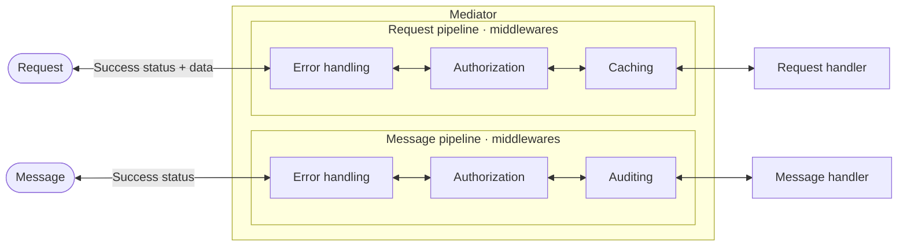
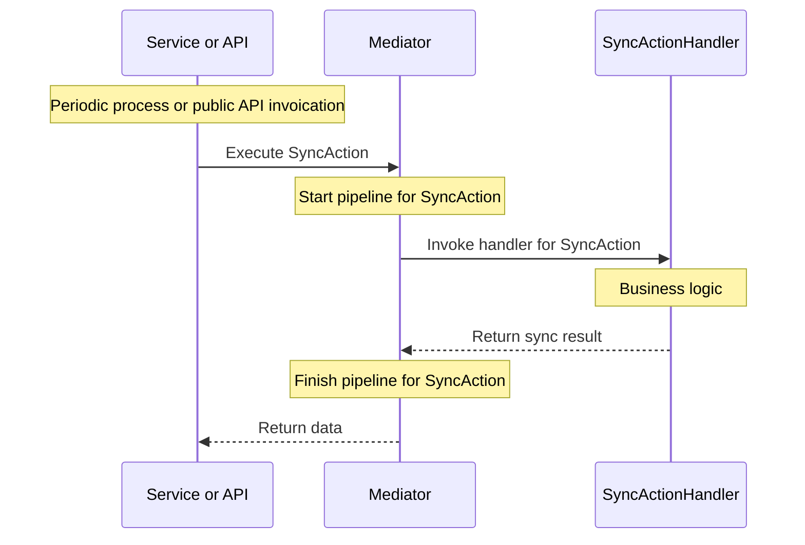
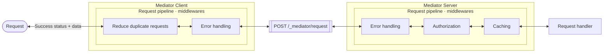
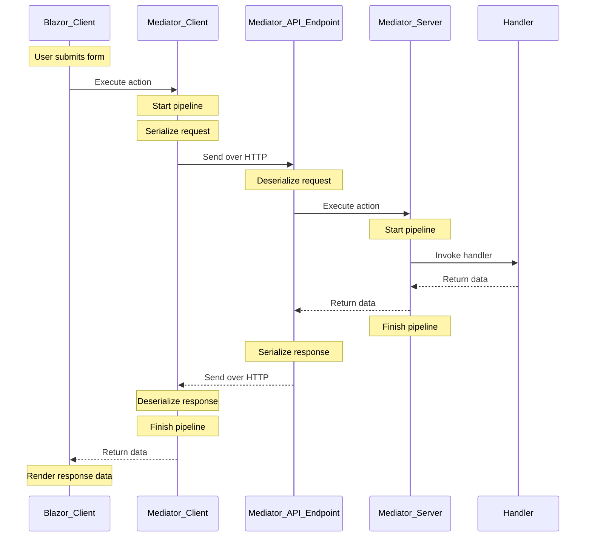
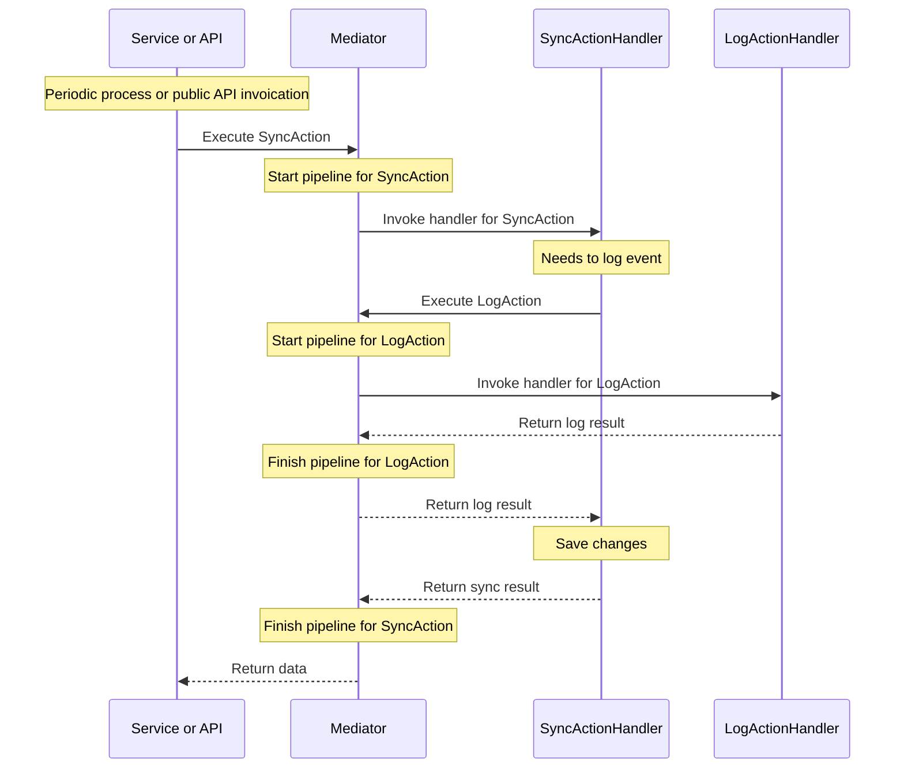

# Mediator pipeline (in process)
Component view of the same flow as the sequence diagram below — redrawn from `img/mediator-in-process.png` / `diagrams.drawio`.

# Simple Mediator call example (in process)

# Mediator pipeline (over HTTP)
Component view of the same flow as the sequence diagram below — redrawn from `img/mediator-over-http.png` / `diagrams.drawio`.

# Mediator call over HTTP

# Nested calls (works for both client and server)

       