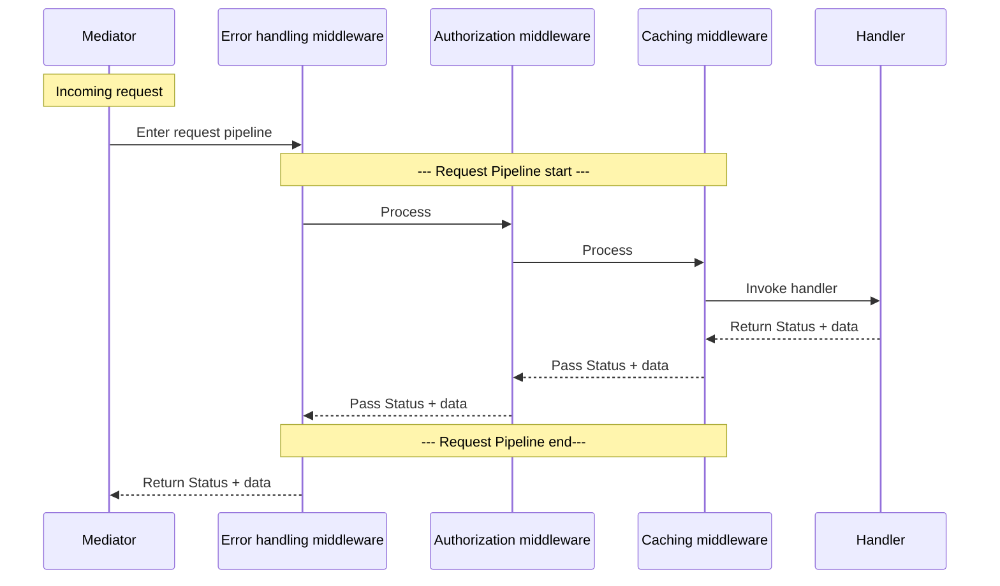

# Pipelines

```mermaid
sequenceDiagram
    participant Mediator
    participant Mid1 as Error handling middleware
    participant Mid2 as Authorization middleware
    participant Mid3 as Caching middleware
    participant Handler

    Note over Mediator: Incoming request
    Mediator->>Mid1: Enter request pipeline
    
    Note over Mid1,Mid3: --- Request Pipeline start ---
    Mid1->>Mid2: Process
    Mid2->>Mid3: Process
    Mid3->>Handler: Invoke handler
    Handler-->>Mid3: Return Status + data
    Mid3-->>Mid2: Pass Status + data
    Mid2-->>Mid1: Pass Status + data
    
    Note over Mid1,Mid3: --- Request Pipeline end---
    Mid1-->>Mediator: Return Status + data


```