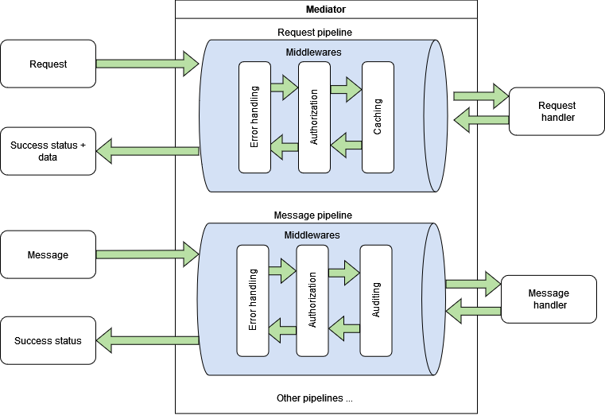

This page first walks through how a call flows through the mediator (context/explanation), then provides a reference glossary of the terms used throughout the rest of this wiki.

## How a call flows

### In-process only
NuGet package `Pipaslot.Mediator` can be used internally by applications without the need to communicate over HTTP. The action execution and handling are described below:

In the easiest scenario, you can use a mediator without a pipeline specification. In that case, the default pipeline will be applied, containing only the middleware that executes the handler.

### Over Http
By registering the mediator via `.AddMediatorClient()` on the client side and `.AddMediatorServer()` on the server side, all actions will be automatically transferred from the client to the server, where the handlers are defined. You can specify pipelines for the client as well as for the server, which is useful, for example, for global error handling and end-user notifications.

## Glossary
- **Mediator** - Service represented by interface `IMediator` executing Actions and providing a response with status and results.
- **Action** - Top-level abstraction for data incoming into the mediator and describing expected results after successful processing. We can logically split the actions into two concepts with more specific names _Request_ and _Message_. We can define our own custom action types and name them by our preferences, but they will have to use either the concept of Request or Message
- **Message** - Implementation of `IMessage` or `IMediatorAction` action type processed by a handler where no result is expected in the mediator response. The mediator will provide only the status of whether the handler was processed successfully.
- **Request** - Implementation of `IRequest<TResult>` or `IMediatorAction<TResult>` action type processed by a handler where the result is expected after successful processing.
- **Handler** - Top-level abstraction for action execution. The handlers can de be divided by their concept into Message handlers and Request handlers.
- **Message handler** - Implementation of`IMessageHandler<in TRequest>` or `IMediatorHandler<TRequest>` executing message without result provided by method `Handle`
- **Request handler** - Implementation of`IRequestHandler<in TRequest, TResponse>` or `IMediatorHandler<TRequest, TResponse>` executing request and providing result by method `Handle`
- **Response** - Result wrapper providing status whether the processing was successful, Result for Request, and Results from middlewares
- **Result collection** - Collection of objects attached by middlewares or returned from handlers. The mediator supports specifying in the pipeline that actions can be handled by multiple handlers. In that case, all handler execution results will be added to this collection. 
- **Result** - Single structure is only taken from Result collection with type matching `TResult` type defined in `IRequest<TResult>` or `IMediatorAction<TResult>`. Returns the first occurrence if multiple objects of the same type are in the Result collection.
- **Pipeline** - Middleware collection applied by custom conditions.
- **Middleware** - Class wrapping handler executions similar to ASP.NET Core middleware wrapping request execution. Provide the ability to define multiple pre-processing and post-processing logic. The Middlewares are not Action-specific.
- **Context** - Data structure handed over across middlewares aggregating results in Result collection and all errors occurred or handled in the pipeline.
- **Feature** - Strongly typed structure that may be added to the Context. Used for communication between different middlewares.
- **Facade**(IMediatorFacade) - It is a service providing capabilities from all Mediator services. Can be used to access the Context, Notification Provider (appends notification as an independent result), and the Mediator itself.

## See also
- [Quickstart: In-process usage](3.-Quickstart-In-process-usage.md) and [Quickstart: Client-Server (Blazor WASM) usage](4.-Quickstart-Client-Server-Blazor-WASM-usage.md) to see these concepts in action.
