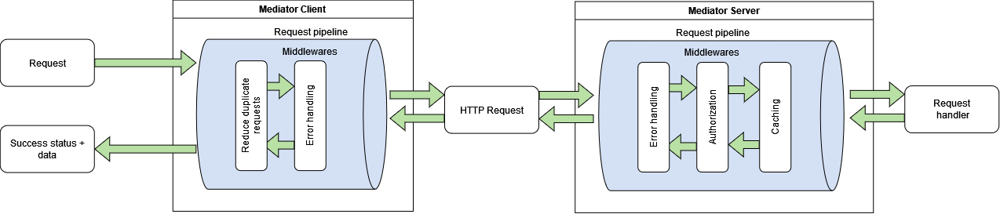

The client-server mediator configuration uses the same principles and interfaces as for in-process usage. The main difference is that you are configuring the mediator on both sides. This allows you to create middlewares on the client side and provide, for example, global error handling or processing of side-effect results designed for frontend processing.
You can also define handlers on the client side, but keep in mind that the default behavior sends the actions over HTTP to the server. If you would like to process these actions directly on the frontend, then you have to configure an action-specific pipeline which executes the handler as the last step instead of sending it over the network.


## Client specific
The client-specific mediator extends the core mediator. You can register it as in the following example:
```
services.AddMediatorClient()
    .AddActionsFromAssemblyOf<WeatherForecast.Request>() //Register all actions
    .AddPipelineForAction<...>(p => p // Define pipelines - optional
        .Use<...>());
```

The default server address (`/_mediator/request`) where all actions will be forwarded can be changed by an overload which exposes a configuration.
```
services.AddMediatorClient(o =>
{
    o.Endpoint = "/api/_mediator/request";
});
```

## Server specific
The server-specific mediator extends the core mediator. You can register it as in the following example:
```
services.AddMediatorServer()
    .AddActionsFromAssemblyOf<WeatherForecast.Request>() //Register all actions
    .AddPipelineForAction<...>(p => p // Define pipelines - optional
        .Use<...>());
```

The default server address (`/_mediator/request`) where all actions will be received from can be changed by an overload which exposes a configuration.
```
services.AddMediatorServer(o =>
{
    o.Endpoint = "/api/_mediator/request";
    o.ErrorHttpStatusCode = 500;// Default value: 500
});
```
**IMPORTANT:** [Mediator](2.-Core-concepts-and-glossary.md#mediator) catches all exceptions that occur during middleware or action handler execution. If you have registered ASP.NET Core middleware processing uncaught exceptions, then exceptions from the mediator will never be propagated to this ASP.NET Core middleware. If you want to process all these uncaught exceptions and, for example, notify the administrator, you have to implement your own Mediator middleware and put it at the beginning of all your pipelines.

**NOTE:** Since version 5.0, you can use IHttpContextAccessor and set the response HTTP status code directly in your middleware to provide a better logging or debugging experience. For example, you can set status 400 (Bad Request) in case of validation errors.
### Error handling

## Communication over HTTP
The mediator supports only the JSON format, which is handled by the mediator internally. The mediator does not support multiple status code handling. If the action succeeds, the mediator server returns status code 200 (OK). If the action fails (including any exception thrown during processing, which is converted into an ErrorMessage in the Mediator [Response](2.-Core-concepts-and-glossary.md#response)), the server returns the status code configured via `ServerMediatorOptions.ErrorHttpStatusCode`, which defaults to 500 (Server Error) - see `o.ErrorHttpStatusCode` above.

### Blazor WASM usage
We recommend that you use `ExceptionLoggingMiddleware`, which logs all error messages in browser consoles together with the action names causing these errors. The mediator adds action names to request URLs for easier action tracking over browser network activity. 
A sample mediator request can then look like: `https://localhost/api/mediator?type=Sample.Shared.Requests.WeatherForecastRequest`

### TypeNameHandling and Security
Generally, TypeNameHandling applied in JSON content is not recommended for [security reasons](https://docs.microsoft.com/en-us/dotnet/standard/serialization/system-text-json-migrate-from-newtonsoft-how-to?pivots=dotnet-6-0#typenamehandlingall-not-supported).
The mediator uses a whitelist approach (credible types) for types that can be deserialized, to reduce the risk of attackers exploiting this feature to execute classes that could harm your system.

**We strongly recommend that you register all actions via the method `AddActionsFromAssemblyOf<...>()` on the client and server mediator to turn on type whitelisting before deserializing data from JSON to C# types. It will protect you against potential exploits of this feature in an attack on your client and server app.**

#### Server
Mediator Server has the whitelisting enabled by default. You only need to provide the location of all your actions transferred over the network.
Server configuration:
``` 
services.AddMediatorServer()
    .AddActionsFromAssemblyOf<MyAction>(); // OR .AddActionsFromAssembly(Assembly.GetExecutingAssembly());
```
It can be disabled. In that case, no action needs to be specified.
``` 
services.AddMediatorServer(o => {
    o.DeserializeOnlyCredibleActionTypes = false;
})
```

#### Client
Mediator Client has the whitelisting disabled by default.
Client minimal configuration:
``` 
services.AddMediatorClient();
```
If you want to enable the whitelisting, you will have to register all actions transferred over the network. Do not forget to also register the result types attached to the response by the server middlewares, via the AddMediatorClient options. 
``` 
services.AddMediatorClient(o =>
    {
        o.DeserializeOnlyCredibleResultTypes = true;
        o.CredibleResultTypes = new Type[]
        {
            typeof(CommonResult)// Type assigned by server middleware
        };
    })
    .AddActionsFromAssemblyOf<MyAction>(); // OR .AddActionsFromAssembly(Assembly.GetExecutingAssembly());
```
Since **Mediator.Http 6.1.0**, you can alternatively use the fluent helpers `AddCredibleResultType<T>()`, `AddCredibleResultAssemblyOf<T>()`, or `AddCredibleResultAssembly(...)` on the options object, which also set `DeserializeOnlyCredibleResultTypes = true` automatically:
``` 
services.AddMediatorClient(o => o
        .AddCredibleResultType<CommonResult>())
    .AddActionsFromAssemblyOf<MyAction>();
```


### Polymorphism limitations 
Serialization used for transferring data over HTTP limits polymorphism in comparison with the in-process mediator scope. These limits come from the System.Text.Json serializer and the JSON format itself. The JSON format does not provide the expected type if you specify any object or its property as an interface or parent class.
However, there is one specific case where you can use an interface or parent class. It is for the `TResult` action types of `IRequest<TResult>` or `IMediatorAction<TResult>`. 

Working example
```
public class MyAction : IMediatorAction<IMyResult>{
    ...
}

public interface IMyResult{
    ...
}

public class MySpecificResult : IMyResult{
    ...
}
```
But it won't work if you want to return a collection of IMyResult.

### Custom HTTP Response
Since Version 6.0.0, the mediator detects if the response has already started. By default, the mediator starts writing JSON responses with all results aggregated during processing. There might be cases when another response is needed. For example, when the mediator is executed via a GET request and a file download is expected. In such a case, you can inject `IHttpContextAccessor` and write your own response in a handler or in a middleware.
```
public class DemoDownloadHandler : IMessageHandler<DemoDownload>
{
    private readonly IHttpContextAccessor _httpContextAccessor;

    public DemoDownloadHandler(IHttpContextAccessor httpContextAccessor)
    {
        _httpContextAccessor = httpContextAccessor;
    }

    public async Task Handle(DemoDownload action, CancellationToken cancellationToken)
    {
        var httpContext = _httpContextAccessor.HttpContext;
        if (httpContext == null)
        {
            throw new InvalidOperationException($"Action {nameof(DemoDownload)} can be used only for request over HTTP.");
        }
        httpContext.Response.ContentType = "text/plain";
        httpContext.Response.Headers["Content-Disposition"] = $"attachment;filename={action.FileName}.txt";
        await httpContext.Response.WriteAsync("Hello File!", cancellationToken);
   }
}
```

### Ignore Read-only properties(Getters) during serialization
Since **Mediator.Http 7.2.0**.
The mediator also serializes read-only properties by default. That includes getters and properties without a public setter. As the contract is shared between the client and server, the value is also re-evaluated after the transfer (the serialization is redundant). 
As an alternative, you can ignore serialization for those properties by adding the [JsonIgnore] attribute.
To ignore them globally, apply the following lines to the mediator configuration on the client and server.
``` 
services.AddMediatorClient(o => 
//OR services.AddMediatorServer(o =>
    {
        o.IgnoreReadOnlyProperties = true;
    })
``` 
WARNING: By enabling the ignore option, you will lose the option to use a private setter together with the constructor. Contracts defined like the following example won't be serialized anymore. 
``` 
public class ContractWithPrivateSetter
{
    public ContractWithPrivateSetter(string name, int value)
    {
        Name = name;
        Value = value;
    }
    public string Name { get; }
    public int Value { get; }
}
``` 
But record classes will still work as expected.