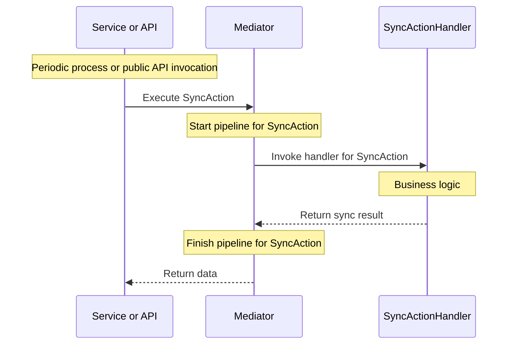
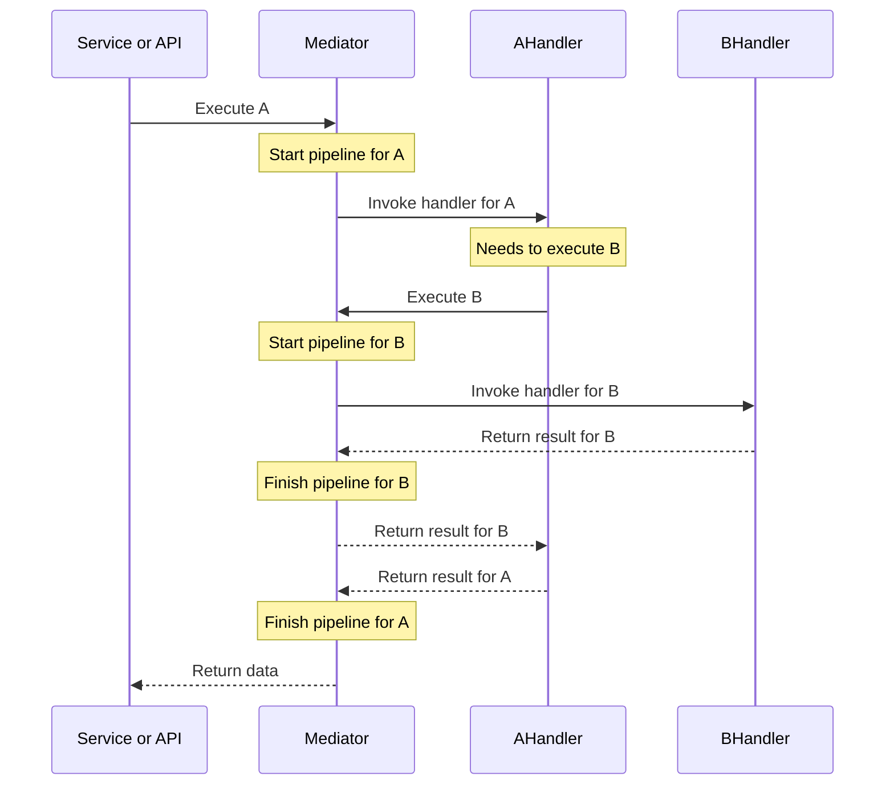

This chapter goes deeper into the `IMediator` interface already used in the [in-process](3.-Quickstart-In-process-usage.md) and [client-server](4.-Quickstart-Client-Server-Blazor-WASM-usage.md) quickstarts.

Execution of any action is made through the `IMediator` interface (it does not matter if it is from the client side or server side). 
Its lifetime is set as scoped by default.
[Mediator](2.-Core-concepts-and-glossary.md#mediator) itself is designed to prevent throwing an exception during action execution. All exceptions are caught and returned in a status wrapper (Response) - see [Exception handling](6.2.-Exception-handling.md) for what the caller receives and how to control it.

## Response
The response object represents the status of the action and whether the action was processed successfully. It contains error messages added to the response during processing or caught during processing. It also contains a [Result Collection](2.-Core-concepts-and-glossary.md#result-collection) holding results from one or more handlers (depending on configuration) and results added by middlewares.

## Execute or Dispatch action with a status response
The most basic methods on `IMediator` are `Dispatch` and `Execute`. These two methods return the [Response](2.-Core-concepts-and-glossary.md#response) object with the status and all results from processing. These methods use the async-await pattern, so it is up to you if you want to dispatch the method and not wait for a response, or execute a request and wait for a response. 
The awaiting is useful, for example, in cases where you need to ensure that action parameters passed validation or authorization rules.

### Type preservation when sending over HTTP
In Client-Server usage, the data sent through the network is serialized and deserialized into the same object type. This gives you the possibility to use type checking `mediatorResponse.Result is MyCustomHandlerResult` or to use property attributes for custom purposes, like shared validation rules on the client and server.

`IMediator.Dispatch` - Executes messages without an expected result. It is applicable to actions implementing the interface `IMediatorAction`, `IMessage`, or derived interfaces.

`IMediator.Execute` - Executes [Request](2.-Core-concepts-and-glossary.md#request) for which you expect a response with data. The Response contains one extra parameter named `Result`, which has a type defined as an action generic argument. It is applicable to actions implementing the interface `IMediatorAction<TResult>`, `IRequest<TResult>`, or derived interfaces. 
If the data is not available for any reason, the status returned in the response will always indicate failure.

A simple in-process call goes straight from the caller through the [pipeline](6.-Pipelines-and-Middlewares.md) to the handler and back:


## ExecuteUnhandled and DispatchUnhandled
These two methods, `IMediator.DispatchUnhandled` and `IMediator.ExecuteUnhandled`, were added later in the mediator API to cover cases where we explicitly expect that the process will be interrupted by an exception if the action processing fails. Both methods do not return the Response wrapper object.

`IMediator.DispatchUnhandled` - Does not return data, but returns only a task that can be awaited.

`IMediator.ExecuteUnhandled` - Returns an awaitable task returning data, which returns the result object directly. In case of an error, an exception will be thrown.

### In-process exceptions
The methods Execute and Dispatch catch all exceptions and never rethrow them. A caught exception is translated into a client-facing error message in the Response: either by a typed exception handler you registered for that exception type via `AddExceptionHandler`, or - when no handler matches - by a fixed generic message, while the original exception is written to the log. The exception's own `Message` is never copied into the Response by default, because the Response is what gets serialized to the client in Client-Server usage.

The methods ExecuteUnhandled and DispatchUnhandled do not catch anything. They rethrow the original exception with its original type, and when the pipeline failed without an exception to rethrow, they throw a `MediatorUnhandledErrorException` (or `MediatorNoHandlerFoundException`/`MediatorMissingResultException` for those two specific causes). Registered exception handlers do not apply here - translation is a concern of the catching boundary only.
Use ExecuteUnhandled and DispatchUnhandled when you need to handle the original exceptions on your own, or when you need to gain more details than just the error message.

See [Exception handling](6.2.-Exception-handling.md) for the full decision table, the registration API, the resolution rules, and migration guidance.

Keep in mind that this works only in the same process where the exception was thrown. Called on the HTTP client, these methods always throw `MediatorUnhandledErrorException` carrying the server's error messages, whatever the server-side cause was: the server executes the action through `Execute`/`Dispatch`, so what crosses the network is a failed Response with messages, and the client pipeline has no original exception left to rethrow. The same applies to a transport failure - an unreachable server or an unparsable response also becomes an error message rather than an exception - while a cancelled operation still surfaces as `OperationCanceledException`. A client that needs to branch on the cause has to read the messages, or call `Execute`/`Dispatch` and inspect the Response.
Exceptions aren't serialized for network transfer because this could be potentially exploited by hackers. 


## Execute and get data or default value
The alternative method for executing requests is `IMediator.ExecuteOrDefault`. This is suitable for developers who want to indicate a successful state by data, and an unsuccessful state by null, and who do not care about error messages because they use global handling in their own mediator middleware.
The dark side of this fact is that **types that are unknown or unavailable on the client won't be deserialized**, and exceptions will be thrown.

The second alternative is to use the method `IMediator.ExecuteOrNew`, which never returns a null value but always constructs a new instance with a parameterless constructor, even if execution fails.


## Access Mediator Context from services
Even if your application mostly processes actions via handlers, you may need to provide custom results from these handlers and from middlewares. 
For example, your handler consumes a notification service, and you need to inform the user about disabled notifications or notify them that the notification service is currently out of service. That can be achieved through assigning notifications or a custom result to the MediatorContext.

The mediator provides the interface `IMediatorContextAccessor` with the properties `Context` and `ContextStack`. 

Property `Context` provides the actual action context in case an action is executed. It will be null outside of an action's execution scope.
Property `ContextStack` provides all action contexts in case of nested execution calls. This stack will be useful in case you execute action A, whose handler injects IMediator and executes action B. Once action B is executed, `Context` will contain the context for action A, and `ContextStack` will contain the context for actions B and A (from inner to outer).

```
public class AHandler(IMediatorFacade mediator) : IMediatorHandler<A>
{
   public async Task Handle(A action, CancellationToken cancellationToken){
      // mediator.Context contains the context of A
      // mediator.ContextStack contains a single context

      await mediator.Dispatch(new B(), cancellationToken);

      // mediator.Context contains again the context of A
      // mediator.ContextStack contains a single context
   }
}
public class BHandler(IMediatorFacade mediator) : IMediatorHandler<B>{
   public Task Handle(A action, CancellationToken cancellationToken){
      // mediator.Context contains the context of B
      // mediator.ContextStack contains contexts for B and A (from inner to outer)

      return Task.CompletedTask;
   }
}
```
The same A-calls-B scenario as a sequence diagram, showing where the nested pipeline for `B` starts and finishes relative to `A`'s:


## Pipaslot.Mediator.IMediatorFacade
Combines `IMediator`, `IMediatorContextAccessor`, and `INotificationProvider` in a single service, useful when a class needs more than one of these together instead of injecting each separately.


## Pipaslot.Mediator.Http.IMediatorUrlFormatter
See [File download (via HTTP GET)](9.3.-Custom-HTTP-responses-and-file-download.md#file-download-via-http-get) in Custom HTTP responses and file download.

## How-to: control handler status from within a handler
There may be specific scenarios when you want to prevent throwing exceptions from the handler because they are caught at the Execute/Dispatch boundary and converted into error messages appearing in the UI. You can instruct the mediator to return the unsuccessful status code via IMediatorContextAccessor.
Example:
```
public class MyHandler(IMediatorContextAccessor mca)
{
   public async Task Handle(MyAction action, CancellationToken cancellationToken){
      try{
         //Operation causing exceptions in some cases
      }catch(MyException){
         mca.Context.Status = ExecutionStatus.Failed;
      }
   }
}
```

## See also
- [Pipelines and Middlewares](6.-Pipelines-and-Middlewares.md) to customize how actions flow through the pipeline.
- [Exception handling](6.2.-Exception-handling.md) for how failures are translated into responses and how to register your own exception handlers.
- [Authorization](7.-Authorization.md) for policy-based access control enforced before handlers run.