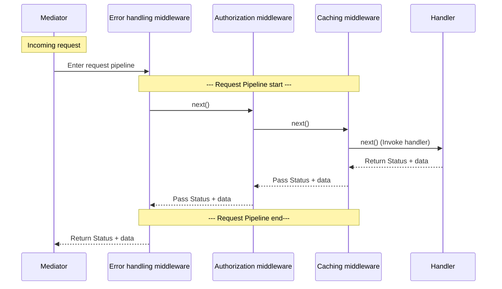

Middleware provides you with the possibility to intercept action execution. With middlewares, you can achieve, for example, caching, auditing, logging, pre-processing, post-processing, and committing transactions...

## Registering actions and handlers
Before the mediator executes an action via a handler, the action is propagated through a pipeline.

The minimal registration for the mediator is through the extension method on the Service Collection:
``` 
services.AddMediator();
```
After this initialization, dependency injection will provide you with the interface `IMediator` described in previous chapters.
But the mediator does not know about handlers at the moment, so it wouldn't be able to execute the action. You must tell it where to look for them. You do not have to register every handler one by one. It is enough to just tell the mediator in which assembly they are defined.
``` 
services.AddMediator()
    .AddHandlersFromAssembly(Assembly.GetExecutingAssembly());
```
or you can specify the assembly by an existing handler seed.
``` 
services.AddMediator()
    .AddHandlersFromAssemblyOf<MyActionHandler>();
```

## Pipelines
Pipelines represent a set of mediator middlewares wrapping handler execution. The principle of mediator middlewares is very similar to the principle of ASP.NET Core middlewares in the application request pipeline.

They are useful in cases when you want to apply different pre-processing or post-processing for handler execution:

_For example, you want to apply caching for [Request](2.-Core-concepts-and-glossary.md#request) responses which should not affect messages. On the other hand, you want to audit all messages sent through a mediator, but do not want to audit Requests._

Pipelines are optional. You can define multiple pipelines for different action types, but only one pipeline will always be used.
Even if you do not specify any pipeline, a default pipeline with a single handler execution middleware will be applied in the background.

Pipelines are chosen by marker interfaces implemented by the action classes like `IRequest` or `IMessage`. The action marker interfaces do not specify the generic return type, even if the action does return some data. They are intended to be used only in the pipeline configuration.
You should not use multiple or shared marker types in actions. If the action marker type is used in multiple pipelines (for example, via inheritance), only the first matching pipeline will be used.

For better understanding, here is a code snippet that describes IRequest<TResult>, its marker interface, and pipeline specification:
```
// Request action describing expected response as generic type.
// Implements IRequest marker interface and top level action definition specifying that this action returns result
public interface IRequest<out TResponse> : IRequest, IMediatorAction<TResponse>{
}

// Request marker interface implementing top level action marker type
public interface IRequest : IMediatorAction    {
}

// Our custom action
public class MyAction : IRequest<MyActionResult>{
    // ... parameters
}
```
and the pipeline configuration will be:
```
services.AddMediator()
    .AddPipelineForAction<IRequest>(p => p
        // ... middleware registration
    )
```

In fact, the handlers are not executed by the mediator itself, but by a specific middleware (implementing the `IExecutionMiddleware` interface) which is at the end of every pipeline.
You do not have to worry if you forget to specify an execution middleware in your pipeline. The mediator always adds a default execution middleware if one is missing.


### Pipeline types
You can register three types of pipelines: an action-specific pipeline, a custom pipeline, and a default pipeline. 

#### Action specific pipeline
Action-specific pipelines use action marker interfaces, and they have higher priority when resolving pipelines in comparison with default pipelines. 
``` 
services.AddMediator()
    .AddPipelineForAction<IMessage>(p => p
        .Use<...>()           // Specify middlewares
    )
    .AddPipelineForAction<IRequest>(p => p
        .Use<...>()           // Specify middlewares
    )
```
The first pipeline will be used if the executed action implements the IMessage marker interface.
The second pipeline will be used if the executed action implements the IRequest marker interface.

In case you need a better-specified condition to decide which pipeline is suitable, you can use the overload accepting a `Func<IMediatorAction, bool>` condition instead of an action marker type.
```
.AddPipelineForAction<IMessage>(p => p.Use<...>())
// Roughly equals to
.AddPipeline(action => action is IMessage, p => p.Use<...>(), identifier: typeof(IMessage).ToString());
```

#### Custom pipeline
You can define your own condition when the pipeline should be used:
``` 
services.AddMediator()   
    .AddPipeline(action => action.UseCustomPipeline, // Define own condition
    p => p 
        .Use<...>()
        ...
    )
    ...
```

#### Default pipeline (default middlewares)
The default middlewares represent a virtual pipeline used as a fallback in case there is no action-specific pipeline matching the executed action.
They are registered as the very last functions on the mediator configurator.
``` 
services.AddMediator()   
    .AddPipeline(action => ..., p => p.Use<...>())// Custom pipeline
    //Here the default pipeline begin
    .Use<...>()        // First default middleware
    .Use<...>()        // Second default middleware
```


### Pipeline override
Every pipeline definition can exist only once. If you register the same pipeline multiple times, the previous pipeline definition will be removed. This behavior is intended for cases where you are building a library with some default pipelines, but you want to provide an option to override the existing pipelines.
``` 
services.AddMediator()
    // **To be ignored**
    .AddPipelineForAction<IMessage>(p => p
        .Use<...>()          // Specify middleware
    )
    // **To be used**
    .AddPipelineForAction<IMessage>(p => p
        .Use<...>()          // Specify middleware
    )
    // Continue defining the default pipeline
    .Use<...>()          // Specify middlewares
```

## Middlewares
You can register one or multiple middlewares to pipelines:
``` 
services.AddMediator()
    .AddPipelineForAction<...>(p => p
        .Use<ErrorHandlingMiddleware>()
        .Use<AuditMiddleware>()
        ....
    )
```

The simplest middleware implementing `IMediatorMiddleware` looks like this:
```
public class DummyMiddleware : IMediatorMiddleware
{
    public async Task Invoke(MediatorContext context, MiddlewareDelegate next)
    {
        // Here place code executed before handler call (before next pipeline middleware call)
        await next(context);
        // Here place code executed after handler call (after next pipeline middleware call)
    }
}
```
The function `next()` is a delegate that runs the next middleware registered in the pipeline.
Do not forget to ensure that you execute `await next(context);`, otherwise, neither the next middleware nor the handler would be executed.

For example, with three custom middlewares registered in a pipeline, code placed before `next()` runs on the way in and code placed after `next()` runs on the way back out, in reverse order:


The `MediatorContext` contains properties like `Action` or `CancellationToken` providing more details about the current action execution.

Handler execution is also realized by a built-in execution middleware, `.UseHandlerExecution()`, applied as the terminal middleware by default. For MediatorClient, it is `.UseHttpClient()` by default.

### Execution Middlewares
Execution middlewares end pipeline execution. Any other middlewares registered in the pipeline after the execution middleware will simply be ignored. 
The difference is that the execution middleware does not call the `next()` delegate.

[Mediator](2.-Core-concepts-and-glossary.md#mediator) library contains a few built-in middlewares to cover your needs. 

_If you need to create your own middleware executing handlers, we recommend implementing the abstract class `ExecutionMiddleware`, containing handling for [Request](2.-Core-concepts-and-glossary.md#request) action types and [Message](2.-Core-concepts-and-glossary.md#message) action types. If you don't implement it, the HandlerExistenceChecker won't be able to check whether all actions have the exact amount of matching handlers._

For the other cases, you can implement the interface `IExecutionMiddleware`.

### Middleware ServiceLifetime
By default, all middlewares are registered with `ServiceLifetime.Scoped`. But you can override this behavior and set it as transient or singleton:
``` 
services.AddMediator()
    .AddPipelineForAction<...>(p => p
        .Use<...>(ServiceLifeTime.Singleton)
        ...
    )
```
NOTE: _You cannot register the same middleware type with different `ServiceLifetime`, even if they are defined in different pipelines._

## Handler ServiceLifetime
Every handler is registered by default in Dependency Injection with **transient** lifetime. But you can override the default lifetime to Scoped or Singleton during the mediator configuration like in the following example: 
```
services.AddMediator()
    .AddHandlers(new []{ typeof(MySingletonMessageHandler)}, ServiceLifetime.Singleton); 
```
Then the instance of `MySingletonMessageHandler` will be created only once, and every `MySingletonMessage` action will use this single instance. You can configure the service to be Scoped, and then the handler will be created and shared per HTTP request or per DI scope on the server.

WARNING: When using Scoped or Singleton lifetime, you are responsible for making the handler thread-safe, as multiple threads can access the shared private state of the handler.

### Limitations of manual ServiceLifetime configuration
You can reach a conflict in the configuration when registering all handlers from the assembly via `mediator.AddHandlersFromAssemblyOf<SeedHandler>()`, but some of them are then registered as Scoped or Singleton via `mediator.AddHandlers(new [] {typeof(MySingletonMessageHandler)})`. The mediator then cannot decide which lifecycle is correct, and throws an exception during startup instead. You can re-register the same handler type, but it always has to have the same `ServiceLifetime`.

### ISingleton and IScoped handler interfaces
From NuGet: Pipaslot.Mediator since version 7.2.0

To overcome the previous limitation, you can use the built-in interfaces `ISingleton` and `IScoped` applied to the handler classes, and then continue using `mediator.AddHandlersFromAssemblyOf<SeedHandler>()`. The mediator will register all the found handlers and set the custom ServiceLifetime for the specific handlers. 

The rule still applies that you cannot register the handler multiple times with a different ServiceLifetime. If you do it (for example, by mistake), the mediator will throw an exception during startup.

## Passing custom parameters to the middleware
You can pass custom parameters to the middleware to change the behaviour depending on the pipeline usage. Parameters are handed over via a [Feature](2.-Core-concepts-and-glossary.md#feature), `MiddlewareParametersFeature`.
``` 
services.AddMediator()
    .AddPipelineForAction<...>(p => p
        .Use<MyMiddleware>(ServiceLifeTime.Singleton, myMiddlewareCustomizationIsEnabled: true)
        ...
    )
    .AddPipelineForAction<...>(p => p
        .Use<MyMiddleware>(ServiceLifeTime.Singleton, myMiddlewareCustomizationIsEnabled: false)
        ...
    )

public class MyMiddleware : IMediatorMiddleware
{
    public Task Invoke(MediatorContext context, MiddlewareDelegate next)
    {
        var feature = context.Features.Get<MiddlewareParametersFeature>();
        var myMiddlewareCustomizationIsEnabled = Convert.ToBoolean(feature.Parameters.FirstOrDefault())

        if (myMiddlewareCustomizationIsEnabled)
        {
            // do the customization
        }
        // Continue to the next middleware in a pipeline
        return next(context);
    }
}
```

## How-to: verify handler registration with HandlerExistenceChecker
Sometimes it may happen that you forget to code a handler for your action, or accidentally create a second handler for the same action. This could cause issues at runtime.
The mediator contains a service which checks that every action has at least one handler, and at most the amount supported by the ExecutionMiddleware in the pipeline.
You can run the following code as an automated test or during startup in development mode.
```
var handlerExistenceChecker = services.GetService<Pipaslot.Mediator.Services.IHandlerExistenceChecker>();
handlerExistenceChecker.Verify(new ExistenceCheckerSetting { CheckMatchingHandlers = true, CheckExistingPolicies = true });
```
but the HandlerExistenceChecker does not know by default where to search for actions to be verified. You have to specify assemblies where the actions are defined via the mediator configuration on the service collection. The registration works the same as for handlers. You can specify the assembly: 
``` 
services.AddMediator()
    .AddActionsFromAssembly(Assembly.GetExecutingAssembly());
```
or you can specify the assembly by an existing action seed.
``` 
services.AddMediator()
    .AddActionsFromAssemblyOf<MyAction>();
```

## How-to: unit-test a custom middleware

A middleware is an ordinary class, but its only parameter - the `MediatorContext` - is created by the mediator. `MediatorContext.Create` builds one directly, so a middleware can be invoked on its own, with a hand-written `next` delegate, and asserted against the context it actually modified:

```csharp
[Fact]
public async Task Invoke_ActionIsStale_FailsWithoutCallingNext()
{
    var context = MediatorContext.Create(new GetOrderRequest());
    var nextWasCalled = false;

    await new StaleActionMiddleware().Invoke(context, _ =>
    {
        nextWasCalled = true;
        return Task.CompletedTask;
    });

    Assert.False(nextWasCalled);
    Assert.Equal(ExecutionStatus.Failed, context.Status);
}
```

The context is real, not a mock, so `AddResult`/`AddError` deduplicate notifications and flip `Status` exactly as they do in production.

Every parameter besides the action is optional, and each one stands in for something the pipeline would otherwise supply:

| Parameter | Omitted | Pass it when |
|---|---|---|
| `services` | resolving any service throws `MediatorException` naming this method | the middleware calls `GetHandlers()` or resolves its own services |
| `mediator` | taken from `services`, otherwise a stub throwing on every call | the middleware makes a nested call and you want a test double for it |
| `cancellationToken` | `CancellationToken.None` | the middleware branches on cancellation |
| `depth` | `1`, so `IsNested` is false | the middleware branches on `IsNested`/`Depth` |

[Features](2.-Core-concepts-and-glossary.md#feature) are arranged after creation the same way a middleware would do it - `context.Features.Set(new MyFeature())` - and `ParentContexts` stays empty, because a synthesized context has no parent chain. Anything that depends on a real parent chain, on pipeline ordering, or on the whole pipeline running is an end-to-end test through `IMediator` instead - see [Mediator API](5.-Mediator-API.md).

The same seam covers exception handlers that read or write the pipeline context - see [Unit-test an exception handler](6.2.-Exception-handling.md#unit-test-an-exception-handler).

## See also
- [Ready-to-use middlewares](6.1.-Ready-to-use-middlewares.md) for built-in middlewares you can plug into a pipeline.
- [Exception handling](6.2.-Exception-handling.md) for what happens to an exception thrown inside a pipeline, and where to translate it.
- [Authorization](7.-Authorization.md), which is itself implemented as a pipeline middleware.
