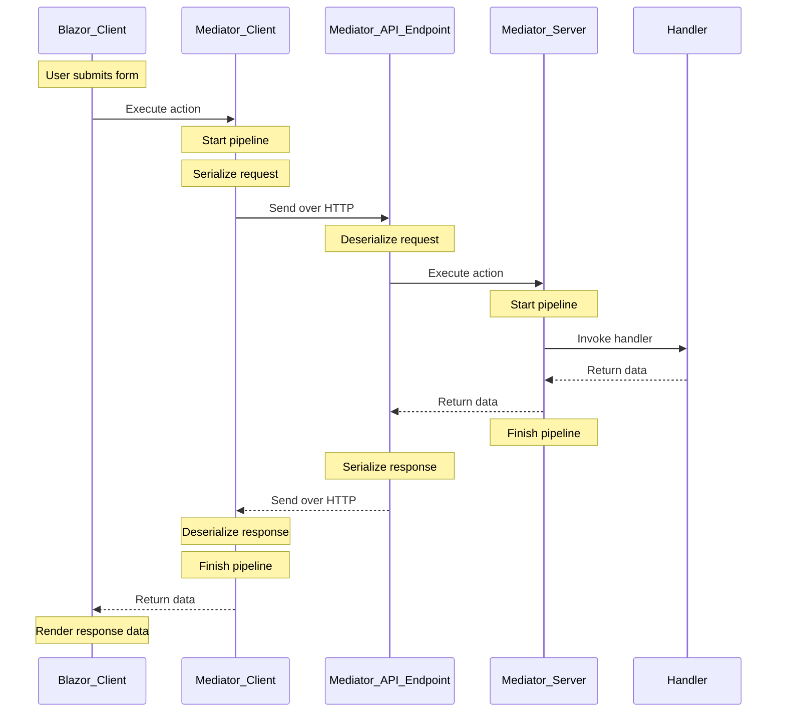

The client-server mediator configuration uses the same principles and interfaces as for in-process usage. The main difference is that you are configuring the mediator on both sides. This allows you to create middlewares on the client side and provide, for example, global error handling or processing of side-effect results designed for frontend processing.
You can also define handlers on the client side, but keep in mind that the default behavior sends the actions over HTTP to the server. If you would like to process these actions directly on the frontend, then you have to configure an action-specific pipeline which executes the handler as the last step instead of sending it over the network.
```text
                                   Mediator Client (pipeline)                                                Mediator Server (pipeline)
                              +--------------------------------+                                +-----------------------------------------------------+
       +---------+            | +-----------+     +----------+ |                                | +----------+     +---------------+     +---------+  |
       | Request |        --> | |           | --> |          | |     +--------------------+     | |          | --> |               | --> |         |  |     +---------+
       +---------+            | |  Reduce   |     |   Error  | | --> |        POST        | --> | |   Error  |     |               |     |         |  | --> | Request |
                              | | duplicate |     | handling | |     | /_mediator/request |     | | handling |     | Authorization |     | Caching |  |     | handler |
+-----------------------+     | | requests  |     |          | | <-- |                    | <-- | |          |     |               |     |         |  | <-- |         |
| Success status + data | <-- | |           | <-- |          | |     +--------------------+     | |          | <-- |               | <-- |         |  |     +---------+
+-----------------------+     | +-----------+     +----------+ |                                | +----------+     +---------------+     +---------+  |
                              +--------------------------------+                                +-----------------------------------------------------+
```
The same flow as a sequence diagram:


## Client specific
The client-specific mediator extends the core mediator. You can register it as in the following example:
```
services.AddMediatorClient()
    .AddActionsFromAssemblyOf<WeatherForecast.Request>() //Register all actions
    .AddPipelineForAction<...>(p => p // Define pipelines - optional
        .Use<...>());
```

The default server address (`/_mediator/request`) where all actions will be forwarded can be changed by an overload which exposes a configuration.
```
services.AddMediatorClient(o =>
{
    o.Endpoint = "/api/_mediator/request";
});
```

`AddContextAccessor` defaults to `false` on the client, so `IMediatorContextAccessor`, `INotificationProvider`, and `IMediatorFacade` are not registered unless you opt in:
```
services.AddMediatorClient(o =>
{
    o.AddContextAccessor = true;
});
```

## Server specific
The server-specific mediator extends the core mediator. You can register it as in the following example:
```
services.AddMediatorServer()
    .AddActionsFromAssemblyOf<WeatherForecast.Request>() //Register all actions
    .AddPipelineForAction<...>(p => p // Define pipelines - optional
        .Use<...>());
```

The default server address (`/_mediator/request`) where all actions will be received from can be changed by an overload which exposes a configuration.
```
services.AddMediatorServer(o =>
{
    o.Endpoint = "/api/_mediator/request";
    o.ErrorHttpStatusCode = 500;// Default value: 500
});
```
**IMPORTANT:** [Mediator](2.-Core-concepts-and-glossary.md#mediator) catches all exceptions that occur during middleware or action handler execution. If you have registered ASP.NET Core middleware processing uncaught exceptions, then exceptions from the mediator will never be propagated to this ASP.NET Core middleware. The mediator logs them itself (see [Server: logging and notifying an administrator](#server-logging-and-notifying-an-administrator)); if you need to react to them in code - for example to notify an administrator - implement your own Mediator middleware and put it at the beginning of all your pipelines, or register a typed [exception handler](6.2.-Exception-handling.md).

**NOTE:** Since version 5.0, you can use IHttpContextAccessor and set the response HTTP status code directly in your middleware to provide a better logging or debugging experience. For example, you can set status 400 (Bad Request) in case of validation errors.
**Prefer `SetResponseStatusCodeHint` instead** - see [Server: choosing the HTTP status code](#server-choosing-the-http-status-code) below.

### Error handling
When called via [`Dispatch`/`Execute`](5.-Mediator-API.md#execute-or-dispatch-action-with-a-status-response) (which is what the HTTP client and server always use internally), exceptions thrown by a handler or by any middleware in the pipeline never propagate to the caller as .NET exceptions. The [Mediator](2.-Core-concepts-and-glossary.md#mediator) catches them, converts them into an error message added to the [Response](2.-Core-concepts-and-glossary.md#response), and marks the response as failed (`Success = false`). This happens identically for in-process and HTTP usage, so a handler never needs to know whether it is being called locally or over HTTP.

The message put into the response is produced by a typed exception handler if you registered one for that exception type, and is a fixed generic message otherwise - the exception's own `Message` is never sent to the client by default, precisely because in Client-Server usage that response travels to a browser. The original exception is logged server-side instead. See [Exception handling](6.2.-Exception-handling.md) for the full decision table and for registering your own handlers.

Note that [Mediator](2.-Core-concepts-and-glossary.md#mediator) also exposes [`DispatchUnhandled`/`ExecuteUnhandled`](5.-Mediator-API.md#executeunhandled-and-dispatchunhandled) counterparts, which do **not** catch handler/middleware exceptions - such exceptions propagate to the caller as-is, and on top of that these methods throw a `MediatorExecutionException` subtype whenever the pipeline did not succeed (no handler found, missing result, or any other failure). The HTTP transport itself never uses them, but your client code may: calling them on the client turns a failed server response back into an exception, always `MediatorUnhandledErrorException` carrying the server's messages, because the original exception stayed on the server (see [In-process exceptions](5.-Mediator-API.md#in-process-exceptions)). Branching on the exception type therefore only works in-process.

The subsections below spell out exactly how this plays out for the server (status codes, logging) and the client (how a failure surfaces to your calling code), each with a copyable middleware recipe.

#### Server: choosing the HTTP status code
When `MediatorMiddleware` writes the response, it resolves the status code in this order:
1. If `Pipaslot.Mediator.Http.IMediatorHttpResult` is present in the root [action](2.-Core-concepts-and-glossary.md#action)'s [Results](2.-Core-concepts-and-glossary.md#result), that result owns the whole response and any status code hint is ignored - see [Custom HTTP responses and file download](9.3.-Custom-HTTP-responses-and-file-download.md).
2. Otherwise, if a status code hint was set via `SetResponseStatusCodeHint` (see below) and the response has not started yet, that status code is applied.
3. Otherwise, if the status code is still the default 200 (OK) and the mediator response failed, it is replaced with `ServerMediatorOptions.ErrorHttpStatusCode` (500 by default).

##### Recommended: `SetResponseStatusCodeHint`
A middleware or handler running for the root action can hint a specific status code (e.g. 400 for a validation error) without touching `HttpContext` directly, via `Pipaslot.Mediator.Http.MediatorContextExtensions.SetResponseStatusCodeHint`:
```csharp
public class ValidatorMiddleware : IMediatorMiddleware
{
    public async Task Invoke(MediatorContext context, MiddlewareDelegate next)
    {
        var errors = validable.Validate();
        if (errors != null && errors.Any())
        {
            context.AddErrors(errors);
            // Notify the client via response status code to improve logging and debugging experience
            context.SetResponseStatusCodeHint((int)HttpStatusCode.BadRequest);
            return; // Short-circuit the pipeline - the handler is not executed 
        }
        await next(context);
    }
}
```
This is why the hint is preferred over writing to `HttpContext.Response.StatusCode` directly: the middleware stays transport-agnostic, with no `IHttpContextAccessor` dependency and no manual root-vs-nested check. Calling `SetResponseStatusCodeHint` while [nested](5.-Mediator-API.md#access-mediator-context-from-services) (`context.IsNested` is `true`) is a no-op - a nested call does not own the root HTTP response, so a hint it sets is simply dropped rather than silently overwriting the status code of the actual root action's response. If more than one hint is set for the same root action, the last one wins, the same way `context.Features.Set(...)` would overwrite an earlier value.

##### Alternative: writing to `HttpContext.Response.StatusCode` directly
You can still use `IHttpContextAccessor` and set the response HTTP status code directly in your middleware. This gives you low-level control, but you lose the safety `SetResponseStatusCodeHint` gives you for nested calls - you have to guard it yourself, the same way [Custom HTTP responses and file download](9.3.-Custom-HTTP-responses-and-file-download.md#alternative-writing-to-httpcontextresponse-directly) documents for writing the response body directly:
```csharp
public class ValidatorMiddleware(IHttpContextAccessor httpContextAccessor) : IMediatorMiddleware
{
    public async Task Invoke(MediatorContext context, MiddlewareDelegate next)
    {
        var errors = validable.Validate();
        if (errors != null && errors.Any())
        {
            context.AddErrors(errors);
            if (!context.IsNested)
            {
                // Notify the client via response status code to improve logging and debugging experience
                var httpContext = httpContextAccessor.HttpContext;
                if (httpContext != null)
                {
                    httpContext.Response.StatusCode = (int)HttpStatusCode.BadRequest;
                }
            }
            return; // Short-circuit the pipeline - the handler is not executed
        }
        await next(context);
    }
}
```

#### Server: logging and notifying an administrator
The `Dispatch`/`Execute` boundary logs every caught exception itself, with the original exception object attached: at `Error` level when nothing translated it (an untranslated exception is treated as an application bug), and at `Warning` level when a registered exception handler produced the client message. Alerting on `Error`-level entries from the mediator is therefore enough to catch unexpected server-side failures - see [Exception handling](6.2.-Exception-handling.md#what-the-boundary-does-with-each-exception) for the complete table.

Replacing an exception with a safe client message is a job for a typed exception handler rather than a middleware, because a middleware that catches an exception also hides it from that logging. A handler receives the pipeline [Context](2.-Core-concepts-and-glossary.md#context) via `context.Context` (see [`IMediatorExceptionContext`](6.2.-Exception-handling.md#imediatorexceptioncontext)), so it can also hint a status code with [`SetResponseStatusCodeHint`](#recommended-setresponsestatuscodehint) the same way a middleware would:
```csharp
public class StorageExceptionHandler : IMediatorExceptionHandler<StorageException>
{
    public Task Handle(StorageException exception, IMediatorExceptionContext context)
    {
        context.SetHandled("Operation failed, please contact administrator");
        context.Context.SetResponseStatusCodeHint((int)HttpStatusCode.Conflict);
        return Task.CompletedTask;
    }
}
```
```csharp
services.AddMediatorServer()
    .AddExceptionHandler<StorageExceptionHandler>()
    ...
```
A middleware is still the right tool when you need the original exception *while the pipeline is still running* - to enrich the log entry with middleware-specific context, to notify an administrator, or to log failures of [`DispatchUnhandled`/`ExecuteUnhandled`](5.-Mediator-API.md#executeunhandled-and-dispatchunhandled) calls, which never reach the catching boundary at all. The [`ExceptionLoggingMiddleware`](6.1.-Ready-to-use-middlewares.md#useexceptionlogging-exceptionloggingmiddleware) shipped with the library (registered via `.UseExceptionLogging()`) does exactly that - it logs any exception passing through it and rethrows it, so it must run near the start of the pipeline:
```csharp
services.AddMediatorServer()
    .UseExceptionLogging() // Logs exceptions via ILogger and rethrows them
    ...
```

#### Client: how failures surface
`HttpClientExecutionMiddleware` (the client's `IExecutionMiddleware` that sends the action over HTTP) never throws for a server-reported failure. It does not check the HTTP status code for success - the status code is purely informational (it is entirely up to your server configuration, see above) - it always tries to deserialize the response body as a Mediator [Response](2.-Core-concepts-and-glossary.md#response). If the server returned an error, the deserialized response simply has `Success = false` with the error notification(s) attached, exactly as it would for an in-process call.
The only cases that throw on the client are:
- Cancellation (`OperationCanceledException`/`TaskCanceledException`), which is rethrown as-is.
- A transport failure (e.g. network/DNS error) or a response body that cannot be parsed as a Mediator response - both are surfaced as a failed response with an error message rather than an exception, and logged via `ILogger`.

Because of this, always check the outcome of a call explicitly instead of relying on try/catch:
```csharp
var response = await mediator.Dispatch(action);
if (!response.Success)
{
    var error = response.GetErrorMessage();
    // handle the error
}
```

## Communication over HTTP
The mediator supports only the JSON format, which is handled by the mediator internally. The mediator does not support multiple status code handling. If the action succeeds, the mediator server returns status code 200 (OK). If the action fails (including any exception thrown during processing, which is converted into an ErrorMessage in the Mediator [Response](2.-Core-concepts-and-glossary.md#response)), the server returns the status code configured via `ServerMediatorOptions.ErrorHttpStatusCode`, which defaults to 500 (Server Error) - see `o.ErrorHttpStatusCode` above.

### Blazor WASM usage
We recommend that you use `ExceptionLoggingMiddleware`, which logs all error messages in browser consoles together with the action names causing these errors. The mediator adds action names to request URLs for easier action tracking over browser network activity. 
A sample mediator request can then look like: `https://localhost/api/mediator?type=Sample.Shared.Requests.WeatherForecastRequest`

### TypeNameHandling and Security
Generally, TypeNameHandling applied in JSON content is not recommended for [security reasons](https://docs.microsoft.com/en-us/dotnet/standard/serialization/system-text-json-migrate-from-newtonsoft-how-to?pivots=dotnet-6-0#typenamehandlingall-not-supported).
The mediator uses a whitelist approach (credible types) for types that can be deserialized, to reduce the risk of attackers exploiting this feature to execute classes that could harm your system.

**We strongly recommend that you register all actions via the method `AddActionsFromAssemblyOf<...>()` on the client and server mediator to turn on type whitelisting before deserializing data from JSON to C# types. It will protect you against potential exploits of this feature in an attack on your client and server app.**

#### Server
Mediator Server has the whitelisting enabled by default. You only need to provide the location of all your actions transferred over the network.
Server configuration:
``` 
services.AddMediatorServer()
    .AddActionsFromAssemblyOf<MyAction>(); // OR .AddActionsFromAssembly(Assembly.GetExecutingAssembly());
```
It can be disabled. In that case, no action needs to be specified.
``` 
services.AddMediatorServer(o => {
    o.DeserializeOnlyCredibleActionTypes = false;
})
```

#### Client
Mediator Client has the whitelisting disabled by default.
Client minimal configuration:
``` 
services.AddMediatorClient();
```
If you want to enable the whitelisting, you will have to register all actions transferred over the network. Do not forget to also register the result types attached to the response by the server middlewares, via the AddMediatorClient options. 
``` 
services.AddMediatorClient(o =>
    {
        o.DeserializeOnlyCredibleResultTypes = true;
        o.CredibleResultTypes = new Type[]
        {
            typeof(CommonResult)// Type assigned by server middleware
        };
    })
    .AddActionsFromAssemblyOf<MyAction>(); // OR .AddActionsFromAssembly(Assembly.GetExecutingAssembly());
```
Since **Mediator.Http 6.1.0**, you can alternatively use the fluent helpers `AddCredibleResultType<T>()`, `AddCredibleResultAssemblyOf<T>()`, or `AddCredibleResultAssembly(...)` on the options object, which also set `DeserializeOnlyCredibleResultTypes = true` automatically:
``` 
services.AddMediatorClient(o => o
        .AddCredibleResultType<CommonResult>())
    .AddActionsFromAssemblyOf<MyAction>();
```


### Polymorphism limitations 
Serialization used for transferring data over HTTP limits polymorphism in comparison with the in-process mediator scope. These limits come from the System.Text.Json serializer and the JSON format itself. The JSON format does not provide the expected type if you specify any object or its property as an interface or parent class.
However, there is one specific case where you can use an interface or parent class. It is for the `TResult` action types of `IRequest<TResult>` or `IMediatorAction<TResult>`. 

Working example
```
public class MyAction : IMediatorAction<IMyResult>{
    ...
}

public interface IMyResult{
    ...
}

public class MySpecificResult : IMyResult{
    ...
}
```
But it won't work if you want to return a collection of IMyResult.

For writing your own HTTP response instead of the default JSON response (e.g. for file download), see [Custom HTTP responses and file download](9.3.-Custom-HTTP-responses-and-file-download.md).

### Ignore Read-only properties(Getters) during serialization
Since **Mediator.Http 7.2.0**.
The mediator also serializes read-only properties by default. That includes getters and properties without a public setter. As the contract is shared between the client and server, the value is also re-evaluated after the transfer (the serialization is redundant). 
As an alternative, you can ignore serialization for those properties by adding the [JsonIgnore] attribute.
To ignore them globally, apply the following lines to the mediator configuration on the client and server.
``` 
services.AddMediatorClient(o => 
//OR services.AddMediatorServer(o =>
    {
        o.IgnoreReadOnlyProperties = true;
    })
``` 
WARNING: By enabling the ignore option, you will lose the option to use a private setter together with the constructor. Contracts defined like the following example won't be serialized anymore. 
``` 
public class ContractWithPrivateSetter(string name, int value)
{
    public string Name { get; } = name;
    public int Value { get; } = value;
}
``` 
But record classes will still work as expected.

## See also
- [Mediator API](5.-Mediator-API.md) for the underlying `Dispatch`/`Execute`/`DispatchUnhandled`/`ExecuteUnhandled` methods.
- [Ready-to-use middlewares](6.1.-Ready-to-use-middlewares.md) for `ExceptionLoggingMiddleware` and other built-in middlewares.
- [Custom HTTP responses and file download](9.3.-Custom-HTTP-responses-and-file-download.md) for writing a non-JSON HTTP response.
